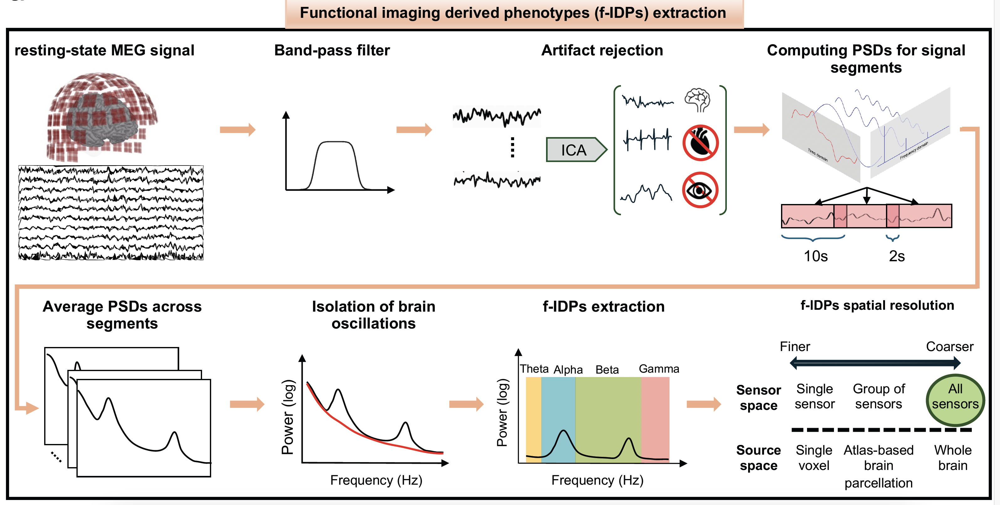

# MEGaNorm (Not Complete)

[](https://www.gnu.org/licenses/gpl-3.0)
[](https://www.python.org/)

[](https://doi.org/10.5281/zenodo.1234567)
[](https://www.python.org/)
[](https://mybinder.org/v2/gh/ML4PNP/MEGaNorm/main?filepath=notebooks%2F)
[](https://meganorm.readthedocs.io/en/latest/?badge=latest)


<p align="center">
  
</p>

<h1 align="center">MEGaNorm</h1>

<p align="center">
  Normative modeling of EEG/MEG brain dynamics across populations and timescales.
</p>


**MEGaNorm** is a Python toolbox for extracting functional imaging-derived phenotypes (f-IDPs) from large-scale EEG and MEG datasets, before normative modeling. It allows researchers to build, visualize, and analyze normative models of brain dynamics across individuals.



&#x20;

---

## 🚀 Features

* Compatibility with MNE-Python, PCNToolkit, FOOOF libraries
* Normative modeling of oscillatory brain activity
* Using high performance capabilities on SLURM clusters 
* EEG and MEG support with BIDS integration
* Easy-to-use API with high customizability
* Ready for reproducible deployment with Docker

---

## 📦 Installation

### Option 1: Using Conda + Pip

We recommend using a clean conda environment:

```bash
# 1. Create and activate environment
conda create --channel=conda-forge --strict-channel-priority --name mne python=3.12 mne
conda activate mne

# 2. Clone and install MEGaNorm
git clone https://github.com/ML4PNP/MEGaNorm.git
cd MEGaNorm/
pip install .
```

---

### Option 2: Using Docker

We provide a pre-configured Docker environment with Jupyter Lab. You can either **build the image locally** or **pull the latest version from Docker Hub**.

#### Option A: Build the image locally

```bash
make build
make run
```

#### Option B: Pull the latest image from Docker Hub

```bash
make pull
make run
```

This mounts:

* `notebooks/` → for saving Jupyter notebooks
* `results/` → for analysis outputs
* `data/` → for raw/processed EEG/MEG data

Jupyter will open in your browser on [http://localhost:8888](http://localhost:8888)

---

## 📒 Getting Started (not complete)

```python 
import meganorm
```

Explore examples in the [`notebooks/`](notebooks/) folder.

---

## 🧚‍♂️ Testing (not complete)

Run unit tests using:

```bash
pytest tests/
```

---

## 🧠 Citing MEGaNorm (not complete)

If you use MEGaNorm in your work, please cite:

```
[To be added: preprint / paper DOI or BibTeX]
```

---

## 🤝 Contributing (not complete)

Contributions, issues and feature requests are welcome!

See [CONTRIBUTING.md](CONTRIBUTING.md) for more info.

---

## 📜 License

This project is licensed under the terms of the **GNU General Public License v3.0** – see the [LICENSE](LICENSE) file for details.
