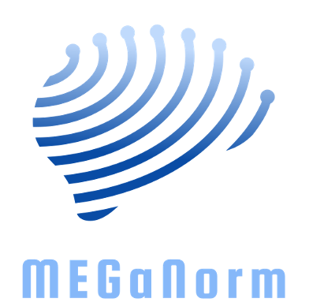
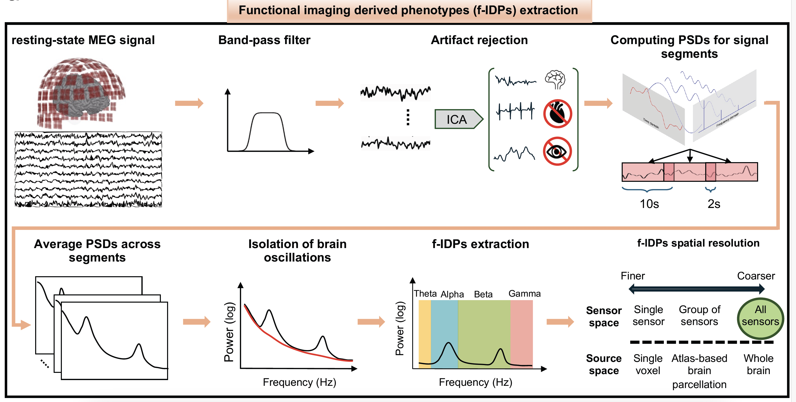
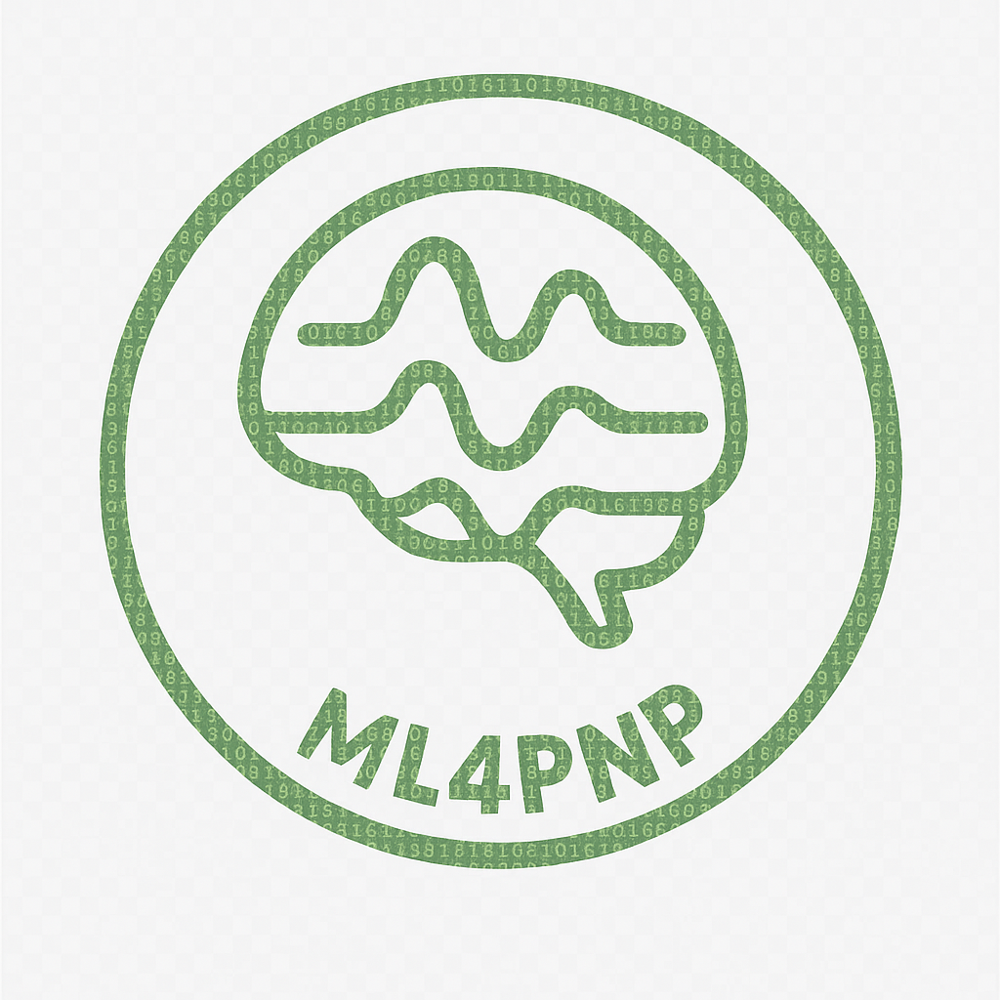

|

MEGaNorm
========

**Normative modeling of brain dynamics from large-scale MEG and EEG data**

MEGaNorm is an open-source Python package for extracting functional
imaging-derived phenotypes (IDPs) from large-scale MEG and EEG datasets
and constructing normative models of brain dynamics across the lifespan.

Built around established neuroimaging and normative-modeling tools,
including `MNE-Python <https://mne.tools/>`_ and
`PCNToolkit <https://pcntoolkit.readthedocs.io/>`_, MEGaNorm provides
a reproducible pipeline from electrophysiological data to individual-level
normative deviation estimates.

Quick Links
-----------

`GitHub <https://github.com/ML4PNP/MEGaNorm>`_
| `PyPI <https://pypi.org/project/meganorm/>`_
| `Documentation <https://meganorm.readthedocs.io/>`_
| `Scientific Paper <https://doi.org/10.1038/s42003-026-09825-2>`_
| `Software DOI <https://doi.org/10.5281/zenodo.15441320>`_

What is MEGaNorm?
-----------------

MEGaNorm provides an integrated workflow for normative modeling of
electrophysiological brain activity. It is designed to support the
analysis of large and heterogeneous MEG and EEG datasets while
facilitating reproducible and scalable research.

The package combines preprocessing and feature extraction with
normative modeling, allowing researchers to characterize population-level
variation in brain dynamics and quantify how individual observations
deviate from expected normative patterns.

MEGaNorm builds upon the broader Python neuroimaging and normative-modeling
ecosystem, particularly `MNE-Python <https://mne.tools/>`_ for MEG/EEG
analysis and `PCNToolkit <https://pcntoolkit.readthedocs.io/>`_ for
normative modeling.

Key Capabilities
----------------

MEGaNorm supports:

* **MEG and EEG processing** using established MNE-Python workflows.
* **Functional IDP extraction** from electrophysiological recordings.
* **Spectral characterization** of oscillatory brain activity.
* **Normative modeling** using PCNToolkit.
* **Individual deviation mapping** relative to normative reference models.
* **BIDS-compatible workflows** for standardized neuroimaging datasets.
* **Large-scale computation** including SLURM/HPC environments.
* **Containerized deployment** using Docker for reproducible analyses.

Installation
------------

MEGaNorm can be installed directly from PyPI:

.. code-block:: bash

   pip install meganorm

Alternatively, the Docker image provides a reproducible environment:

.. code-block:: bash

   docker pull smkia/meganorm:latest

For fully reproducible analyses, a specific release can be selected:

.. code-block:: bash

   docker pull smkia/meganorm:0.2.1

For available releases and package metadata, see the
`MEGaNorm PyPI page <https://pypi.org/project/meganorm/>`_.

Getting Started
---------------

After installation, explore the documentation below for the available
modules, functions, and processing components.

The MEGaNorm repository also provides example notebooks demonstrating
the main analysis workflow.

`Explore the example notebooks on GitHub
<https://github.com/ML4PNP/MEGaNorm/tree/main/notebooks>`_

Documentation
-------------

.. toctree::
   :maxdepth: 2
   :caption: API Reference

   modules

Citation
--------

If you use MEGaNorm in your research, please cite the software package
and the associated scientific publication where appropriate.

Citing the Package
~~~~~~~~~~~~~~~~~~

The MEGaNorm software is archived on Zenodo:

`DOI: 10.5281/zenodo.15441320
<https://doi.org/10.5281/zenodo.15441320>`_

**Recommended citation**

   Zamanzadeh, M., Verduyn, Y., & Kia, S. M. (2025).
   *MEGaNorm: a Python package for normative modeling on MEG and EEG data
   (v0.1.0).* Zenodo.

BibTeX and other citation formats can be downloaded directly from the
`MEGaNorm Zenodo record <https://doi.org/10.5281/zenodo.15441320>`_.

Citing the Paper
~~~~~~~~~~~~~~~~

For the scientific methodology and normative modeling framework, please
cite the associated publication in *Communications Biology*:

   Zamanzadeh, M., Verduyn, Y., de Boer, A., Ros, T., Wolfers, T.,
   Dinga, R., Šafář Postma, M., Marquand, A. F., van Wingerden, M.,
   & Kia, S. M. (2026).
   *Normative modeling of MEG brain oscillations across the human lifespan.*
   Communications Biology.

`DOI: 10.1038/s42003-026-09825-2
<https://doi.org/10.1038/s42003-026-09825-2>`_

Developed by ML4PNP
-------------------

MEGaNorm is developed and maintained by the
`Machine Learning for Precision NeuroPsychiatry (ML4PNP) Lab
<https://ml4pnp.github.io/>`_.

Indices
-------

* :ref:`genindex`
* :ref:`modindex`
* :ref:`search`